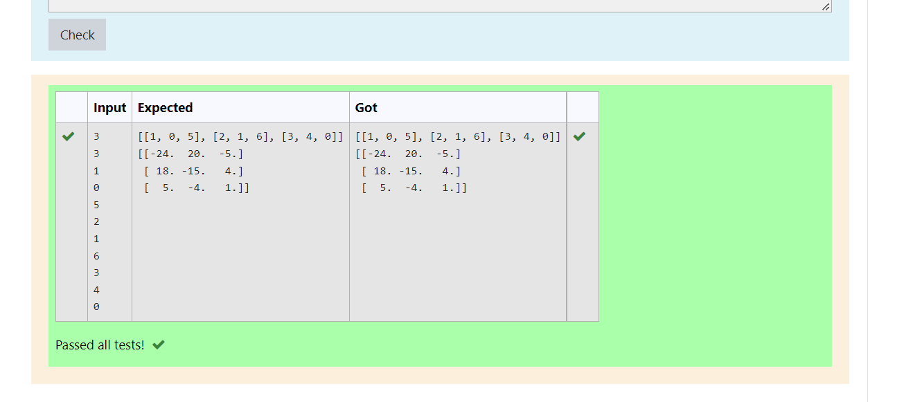

# Inverse-of-matrix

## AIM:
To write a python program to find inverse a matrix.

## ALGORITHM:

### Step 1:
Start python program.
### Step 2:
Import numpy.Create two null lists.
### Step 3:
Get the parameters and the elements from the user using for loops.
### Step 4:
Inverse the matrix using linalg library.
### Step 5:
End the program.


## PROGRAM:
```
Developed by: Jeeva Abishake
Roll NO. : 212221240018
import numpy as np
col=int(input())
row=int(input())
l1,l2=[],[]
for i in range (row):
    for i in range (col):
        l1.append(int(input()))
    l2.append(l1)
    l1=[]
print(l2)
print(np.linalg.inv(l2))
```

## OUTPUT:


## RESULT:
Thus the program is written to find the inverse of a matrix.
